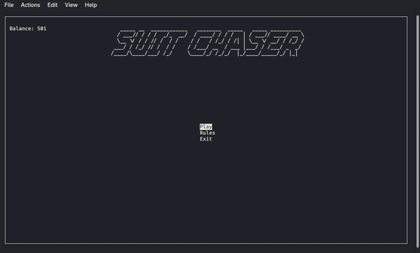

    

# SuitChaser
SuitChaser is designed to emulate horse betting using a deck of 52 plain cards were the aces are racing to be the first to cross the line.  
The player can make a bet on a suit of his choice with the house minimum being 2, standard factional betting applies  
During the race the player can decide to flip a hidden card which will set an Ace of the matching suit back by one space.  
 
**Play to make millions or until you have nothing left**

# Installation
Python Curses library comes with the Python standard library but for windows users you will need to install it using  
`python -m pip install windows-curses` or  `pip install -r requirements.txt`

### Instructions
- Check your balance and get racing by clicking Play
- Place a bet (2 <= bet => balance)
- Choose your racer UP and DOWN arrow keys to move / ENTER to select
- Race (UP arrow key to flip a hidden card)
- Collect your Winnings

### Preview of the Game

